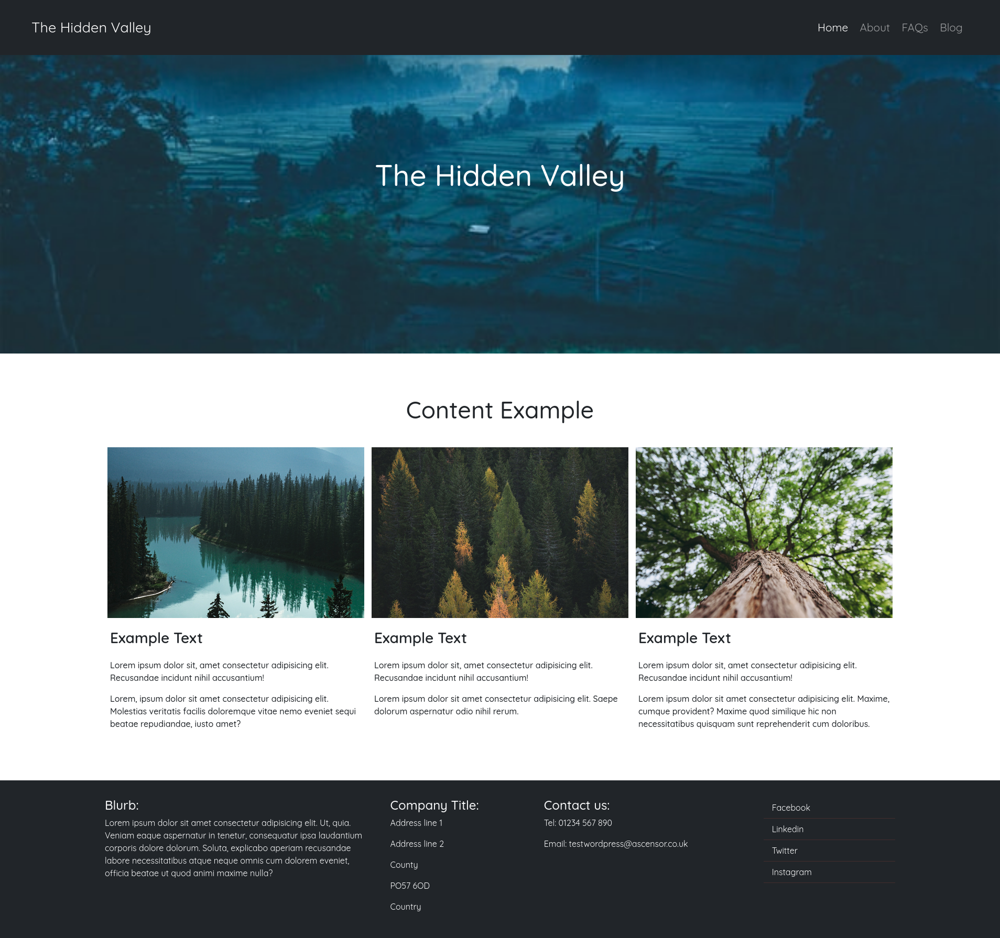

# The Hidden Valley - Ascensor Assessment

_A custom WordPress theme created with HTML, Bootstrap 5, SCSS compiled to CSS and Jquery to JavaScript with Laravel-Mix._

---



## 

You can find the repository on my [**GitHub**](https://github.com/Nesh00/The-Hidden-Valley) account and clone it down or just download the ZIP file.

```
git clone https://github.com/Nesh00/The-Hidden-Valley
```

---

## Basic requirements

If you want to run this app on your local machine, make sure you have versions [**NodeJS v16.11.0**](https://nodejs.org/en/), [**WordPress**](https://wordpress.org/), [**PHP**](https://www.php.net), [**MySQL**](https://www.mysql.com) and any server you prefer installed. For this project I've used XAMPP for a quick setup on my local PC.

---

## Installation

Once you have the repository on your computer, install the npm packages so you can compile your SCSS and Jquery.

```
npm install
```

---

## Author

Nenad Tsvetanovski

---
